# SocialMedia - Соціальна мережа


---

## Мета проєкту

Цей проєкт створювався як ознайомлення з фреймворком Django та принципами розробки соціальних мереж. Поглибити свої знання у веб-розробці, створивши повноцінну соціальну мережу з можливістю взаємодії користувачів у реальному часі.

**Кому буде корисний:**
- Початківцям у Django, які хочуть побачити реальний приклад соціальної мережі
- Розробникам, що цікавляться WebSocket'ами та real-time комунікацією
- Студентам, які вивчають веб-розробку на Python
- Всім, хто хоче зрозуміти архітектуру соціальних мереж

---

## Зміст

1. [Назва проєкту](#socialmedia---соціальна-мережа)
2. [Мета проєкту](#мета-проєкту)
3. [Зміст проєкту](#зміст-проєкту)
4. [Структура проєкту](#структура-проєкту)
5. [Розгортання проєкту](#розгортання-проєкту-на-локальному-пк)
6. [Налаштування віртуального оточення](#налаштування-віртуального-оточення)
7. [Запуск проєкту](#запуск-проєкту)
8. [Особливості розробки](#особливості-розробки)
9. [Висновок](#висновок)

---

## Зміст проєкту

Проєкт включає в себе наступні основні додатки:

### Головна сторінка
- Стрічка новин з постами друзів
- Можливість створення нових постів

### Друзі
- Відправка та прийняття заявок у друзі
- Рекомендації нових друзів
- Перегляд профілів користувачів

### Чати
- Особисті чати між користувачами
- Групові чати з можливістю додавання учасників
- Обмін повідомленнями у реальному часі
- Відправка зображень у чатах

### Альбоми та медіа
- Створення та редагування альбомів
- Налаштування приватності альбомів

### Налаштування профілю
- Редагування особистої інформації
- Зміна аватара

### Мої публікації
- Перегляд власних постів
- Редагування та видалення публікацій

*[ Повернутися до змісту](#зміст)*

---

## Структура проєкту

```mermaid
%%{ init : { "theme" : "forest", "flowchart" : { "curve" : "basis" }, "themeVariables": { "fontFamily": "Nunito" } }}%%
flowchart LR
    A(SocialMedia) --> B(chats)
    A --> C(friends)
    A --> D(main_page)
    A --> E(my_publications)
    A --> F(my_settings)
    A --> G(user)
    A --> H(SocialMedia)
    A --> I(static)
    A --> J(templates)
    A --> K([manage.py])
    A --> L([requirements.txt])

    BA(chats dummy):::hidden --> BB(templates)
    BA --> BC(static)
    BA --> BD([__init__.py])
    BA --> BE([admin.py])
    BA --> BF([apps.py])
    BA --> BG([consumers.py])
    BA --> BH([models.py])
    BA --> BI([routing.py])
    BA --> BJ([tests.py])
    BA --> BK([urls.py])
    BA --> BL([views.py])

    BB(templates) --> BBA(chats)
    BBA --> BBAA([chats.html])
    BC(static) --> BCA(css)
    BC --> BCB(js)
    BCA --> BCAA(chats)
    BCAA --> BCAAA([chats.css])
    BCB --> BCBA(chats)
    BCBA --> BCBAA([chats.js])

    B --> BA

    CA(friends dummy):::hidden --> CB(templates)
    CA --> CC(static)
    CA --> CD([__init__.py])
    CA --> CE([admin.py])
    CA --> CF([apps.py])
    CA --> CG([models.py])
    CA --> CH([tests.py])
    CA --> CI([urls.py])
    CA --> CJ([views.py])

    CB(templates) --> CBA(friends)
    CBA --> CBAA([allfriends.html])
    CBA --> CBAB([friend_page.html])
    CBA --> CBAC([friends.html])
    CBA --> CBAD([recommendations.html])
    CBA --> CBAE([requests.html])

    CC(static) --> CCA(css)
    CC --> CCB(js)
    CCA --> CCAA(friends)
    CCAA --> CCAAA([allfriends.css])
    CCAA --> CCAAB([friend_page.css])
    CCAA --> CCAAC([friends.css])
    CCAA --> CCAAD([recommendations.css])
    CCAA --> CCAAE([requests.css])
    CCB --> CCBA(friends)
    CCBA --> CCBAA([friend_page.js])
    CCBA --> CCBAB([friends.js])

    C --> CA

    DA(main_page dummy):::hidden --> DB(templates)
    DA --> DC(static)
    DA --> DD([__init__.py])
    DA --> DE([admin.py])
    DA --> DF([apps.py])
    DA --> DG([forms.py])
    DA --> DH([models.py])
    DA --> DI([tests.py])
    DA --> DJ([urls.py])
    DA --> DK([views.py])

    DB(templates) --> DBA(main_page)
    DBA --> DBAA([main_page.html])
    DC(static) --> DCA(css)
    DC --> DCB(js)
    DCA --> DCAA(main)
    DCAA --> DCAAA([mainStyle.css])
    DCB --> DCBA(main)
    DCBA --> DCBAA([mainScripts.js])

    D --> DA

    EA(my_publications dummy):::hidden --> EB(templates)
    EA --> EC(static)
    EA --> ED([__init__.py])
    EA --> EE([admin.py])
    EA --> EF([apps.py])
    EA --> EG([models.py])
    EA --> EH([tests.py])
    EA --> EI([urls.py])
    EA --> EJ([views.py])

    EB(templates) --> EBA(my_publications)
    EBA --> EBAA([my_publications.html])
    EC(static) --> ECA(css)
    EC --> ECB(js)
    ECA --> ECAA(my_publications)
    ECAA --> ECAAA([publicationsStyle.css])
    ECB --> ECBA(my_publications)
    ECBA --> ECBAA([publicationsScript.js])

    E --> EA

    FA(my_settings dummy):::hidden --> FB(templates)
    FA --> FC(static)
    FA --> FD(commands)
    FA --> FE([__init__.py])
    FA --> FF([admin.py])
    FA --> FG([apps.py])
    FA --> FH([forms.py])
    FA --> FI([models.py])
    FA --> FJ([tests.py])
    FA --> FK([urls.py])
    FA --> FL([views.py])

    FB(templates) --> FBA(my_settings)
    FBA --> FBAA([albums.html])
    FBA --> FBAB([my_settings.html])
    FC(static) --> FCA(css)
    FC --> FCB(js)
    FCA --> FCAA(my_settings)
    FCAA --> FCAAA([albums.css])
    FCAA --> FCAAB([my_settings.css])
    FCB --> FCBA(my_settings)
    FCBA --> FCBAA([albums.js])
    FCBA --> FCBAB([settings.js])
    FD(commands) --> FDA([cleanup_password_sessions.py])

    F --> FA

    GA(user dummy):::hidden --> GB(templates)
    GA --> GC(static)
    GA --> GD(commands)
    GA --> GE([__init__.py])
    GA --> GF([admin.py])
    GA --> GG([apps.py])
    GA --> GH([forms.py])
    GA --> GI([models.py])
    GA --> GJ([tests.py])
    GA --> GK([urls.py])
    GA --> GL([views.py])

    GB(templates) --> GBA(user)
    GBA --> GBAA([login.html])
    GBA --> GBAB([registration.html])
    GBA --> GBAC([user.html])
    GC(static) --> GCA(css)
    GC --> GCB(js)
    GCA --> GCAA(login)
    GCAA --> GCAAA([style.css])
    GCA --> GCAB(registration)
    GCAB --> GCABA([style.css])
    GCA --> GCAC(user)
    GCAC --> GCACA([style.css])
    GCB --> GCBA(registration)
    GCBA --> GCBAA([scripts.js])
    GD(commands) --> GDA([clenup_sessions.py])

    G --> GA

    HA(SocialMedia dummy):::hidden --> HB([__init__.py])
    HA --> HC([asgi.py])
    HA --> HD([settings.py])
    HA --> HE([urls.py])
    HA --> HF([wsgi.py])

    H --> HA

    IA(static dummy):::hidden --> IB(css)
    IB --> IC([style.css])

    I --> IA

    JA(templates dummy):::hidden --> JB([base.html])

    J --> JA

    classDef hidden display: none
```



*[  Повернутися до змісту](#зміст)*

---

## Розгортання проєкту на локальному ПК

### Для Windows:

1. **Установіть Git** (якщо ще не встановлений):
   - Завантажте з [git-scm.com](https://git-scm.com/)
   - Установіть з налаштуваннями за замовчуванням

2. **Клонуйте репозиторій:**
   ```bash
   git clone https://github.com/YuliiaKavunenko/SocialMedia.git
   cd SocialMedia
   ```

3. **Установіть Python** (версія 3.8 або новіша):
   - Завантажте з [python.org](https://www.python.org/)
   - Під час встановлення обов'язково поставте галочку "Add Python to PATH"

### Для macOS:

1. **Встановіть Homebrew** (якщо ще не встановлений):
   ```bash
   /bin/bash -c "$(curl -fsSL https://raw.githubusercontent.com/Homebrew/install/HEAD/install.sh)"
   ```

2. **Встановіть Git та Python:**
   ```bash
   brew install git python
   ```

3. **Клонуйте репозиторій:**
   ```bash
   git clone https://github.com/YuliiaKavunenko/SocialMedia.git
   cd SocialMedia
   ```

*[Повернутися до змісту](#зміст)*

---

## Налаштування віртуального оточення

### Для Windows:

1. **Створіть віртуальне оточення:**
   ```bash
   python -m venv venv
   ```

2. **Активуйте віртуальне оточення:**
   ```bash
   venv/Scripts/activate.bat
   ```

3. **Встановіть залежності:**
   ```bash
   pip install -r requirements.txt
   ```

### Для macOS:

1. **Створіть віртуальне оточення:**
   ```bash
   python3 -m venv venv
   ```

2. **Активуйте віртуальне оточення:**
   ```bash
   source venv/bin/activate.bat
   ```

3. **Встановіть залежності:**
   ```bash
   pip install -r requirements.txt
   ```

**Важливо:** Файл requirements.txt містить всі необхідні бібліотеки, включаючи Django, Channels для WebSocket'ів, Pillow для роботи з зображеннями та інші залежності.

*[Повернутися до змісту](#зміст)*

---

## Запуск проєкту

### Для Windows та macOS (команди однакові):

1. **Переконайтеся, що віртуальне оточення активоване**

2. **Перейдіть до папки з проєктом:**
   ```bash
   cd SocialMedia
   ```

3. **Виконайте міграції бази даних:**
   ```bash
   python manage.py makemigrations
   python manage.py migrate
   ```

4. **Створіть суперкористувача:**
   ```bash
   python manage.py createsuperuser
   ```

5. **Запустіть сервер розробки:**
   ```bash
   python manage.py runserver
   ```

6. **Відкрийте браузер та перейдіть за адресою:**
   ```
   http://127.0.0.1:8000/
   ```

*[Повернутися до змісту](#зміст)*

---

## Особливості розробки

### Робота з зображеннями

Система обробки зображень реалізована через модель Image та інтеграцію з Pillow. Користувачі можуть:

- Завантажувати зображення для постів (до 9 фото за раз)
- Створювати аватари з автоматичним ресайзингом
- Організовувати фото в альбоми з налаштуваннями приватності
- Переглядати зображення в адаптивній галереї

Зображення зберігаються в медіа-папці з унікальними іменами для уникнення конфліктів. Реалізована система превью для швидкого завантаження.


**Детальна реалізація:** 
[my_settings/views.py](SocialMedia/my_settings/views.py)
[my_publications/views.py](SocialMedia/my_publications/views.py)
[main_page/views.py](SocialMedia/main_page/views.py)
### Робота з веб-сокетами

WebSocket з'єднання реалізовані через Django Channels для забезпечення real-time комунікації:

- Автентифікація користувачів через WebSocket
- Групові кімнати для чатів
- Миттєва доставка повідомлень
- Підтримка текстових повідомлень та зображень

Кожен чат має свою унікальну групу, що дозволяє ізолювати повідомлення між різними розмовами. Система також підтримує оновлення списку чатів у реальному часі.


**Детальна реалізація:** [chats/consumers.py](SocialMedia/chats/consumers.py)

### Принцип роботи постів та альбомів

**Пости:**
- Створення через модальне вікно
- Підтримка множинних зображень з адаптивним відображенням
- Система тегів для категоризації контенту
- Можливість додавання URL-посилань

**Альбоми:**
- Організація фотографій за темами
- Налаштування видимості (публічні/приватні)
- Можливість додавання/видалення фото
- Автоматичне створення превью альбому


**Детальна реалізація:** 
[main_page/models.py](SocialMedia/main_page/models.py)
[main_page/static/js/main/mainScripts.js](SocialMedia/main_page/static/js/main/mainScripts.js)
[my_settings/static/js/my_settings/albums.js](SocialMedia/main_page/models.py)
[my_publications/static/js/my_publications/publicationsScripts.js](SocialMedia/main_page/models.py)


### Принцип роботи чатів

**Індивідуальні чати:**
- Автоматичне створення при першому повідомленні
- Відображення імені співрозмовника як назви чату
- Показ аватара співрозмовника

**Групові чати:**
- Створення з вибором учасників зі списку друзів
- Можливість додавання/видалення учасників (тільки адміном)
- Налаштування назви та аватара групи
- Система ролей (адмін/учасник)

Всі повідомлення групуються за датами для зручності перегляду. Реалізована система пошуку контактів та швидкого переходу до чатів.


**Детальна реалізація:** 
[chats/views.py](SocialMedia/chats/views.py)
[chats/static/js/chats/chats.js](SocialMedia/chats/static/js/chats/chats.js)

### Робота з AJAX

AJAX запити використовуються для:

- Пошук користувачів без перезавантаження сторінки
- Додавання/видалення друзів
- Завантаження фотографій в альбоми
- Оновлення налаштувань профілю
- Створення та редагування груп

Використовується CSRF захист для безпеки.


### Принцип роботи реєстрації та авторизації

**Реєстрація:**
1. Заповнення форми з email та паролем
2. Відправка коду підтвердження на email
3. Введення 6-значного коду
4. Активація акаунту

**Авторизація:**
- Вхід через email та пароль
- Перевірка активації акаунту
- Створення сесії користувача

Система використовує Django's вбудовану автентифікацію з додатковою верифікацією через email. Паролі хешуються для безпеки.


**Детальна реалізація:** [user/views.py](SocialMedia/user/views.py)

### Принцип роботи системи друзів

**Додавання друзів:**
1. Відправка заявки у друзі
2. Отримання сповіщення адресатом
3. Прийняття або відхилення заявки

**Функціонал:**
- Перегляд списку всіх друзів
- Рекомендації нових користувачів
- Управління вхідними заявками
- Можливість видалення з друзів

Система виключає дублювання заявок та автоматично фільтрує вже існуючі зв'язки між користувачами.


**Детальна реалізація:** [friends/views.py](SocialMedia/friends/views.py)

*[  Повернутися до змісту](#зміст)*

---

## Висновок

Створення цього проєкту стало для мене надзвичайно цінним досвідом, який значно розширив мої знання у веб-розробці та поглибив розуміння архітектури складних додатків.

**Технічні навички, які я здобула:**

Робота з Django фреймворком дала мене розуміння MVT (Model-View-Template) архітектури та принципів побудови веб-додатків. Я навчилась створювати складні моделі даних з різними типами зв'язків, писати ефективні запити до бази даних та оптимізувати продуктивність додатку. Особливо цінним був досвід роботи з Django ORM, який дозволив мені зрозуміти, як абстрагуватися від SQL та працювати з базою даних на більш високому рівні.

Інтеграція WebSocket'ів через Django Channels стала справжнім викликом, який допоміг мені зрозуміти принципи комунікації в реальному часі у веб-додатках. Я навчилась працювати з асинхронним кодом, управляти з'єднаннями користувачів та забезпечувати стабільну роботу чатів навіть при великій кількості одночасних користувачів.

**Розуміння архітектури соціальних мереж:**

Проєкт дав мені глибоке розуміння того, як влаштовані соціальні мережі зсередини. Була зрозуміла складність системи друзів, де потрібно враховувати різні стани відносин між користувачами (друзі, відправлена заявка, отримана заявка, незнайомці). Реалізація системи постів з можливістю додавання медіа-контенту, тегів та посилань показала мені, наскільки важливо продумувати структуру даних заздалегідь.

**Робота з медіа-контентом:**

Особливо цікавою була робота з зображеннями - від завантаження та валідації файлів до створення адаптивних галерей та системи альбомів. Були здобуті цінні навички оптимізації зображення для веб-використання, створювати превью та забезпечення безпечного зберігання файлів користувачів.

**Frontend та UX досвід:**

Хоча основний фокус був на backend розробці, робота над інтерфейсом користувача дала мені розуміння важливості UX/UI дизайну. Створювати інтуїтивні інтерфейси з Figma проєкту, працювати з JavaScript для динамічної взаємодії та забезпечувати адаптивність на різних пристроях.

**Безпека та оптимізація:**

Проєкт показав наскільки важлива безпека данних. Було встановлено систему CSRF захисту, валідацію даних, безпечну автентифікацію з верифікацією email та захист від SQL-ін'єкцій. Також я зрозуміла важливість оптимізації запитів до бази даних та кешування для забезпечення швидкої роботи додатку.

**Управління проєктом:**

Робота над великим проєктом навчила мене правильно структурувати код, розділяти функціонал на логічні модулі та підтримувати чистоту архітектури.

**Виклики та їх подолання:**

Найбільшим викликом стала реалізація чатів в реальному часі з підтримкою груп та особистих повідомлень. Довелося глибоко вивчити Django Channels, асинхронне програмування та WebSocket протокол. Також складною виявилась логіка створення та редагування постів, щоб усі данні з форми зберігалися і корректно відображалися у користувачів.

**Перспективи розвитку:**

Завершивши цей проєкт, я отримала міцну основу для подальшого розвитку у веб-розробці. Цей проєкт не тільки навчив мене працювати з фреймворком Django, але й дав розуміння того, як створювати масштабовані, безпечні та зручні веб-додатки. Він став відмінною відправною точкою для мене у веб-розробці.

*[  Повернутися до змісту](#зміст)*

---

**Технології:** Django, Python, JavaScript, HTML/CSS  
